# Creative AI Database ERD & Relational Specification

## Entity Relationship Diagram (Mermaid)

```mermaid
erDiagram
    USERS ||--o| USER_SETTINGS : owns
    USERS ||--o| GAME_PREFERENCES : has
    USERS ||--o{ PASSWORD_RESET_TOKENS : requests
    USERS ||--o{ USER_SESSIONS : authenticates
    USERS ||--o{ CHAT_CONVERSATIONS : owns
    USERS ||--o{ IMAGE_GENERATIONS : creates
    USERS ||--o{ MUSIC_GENERATIONS : creates
    USERS ||--o{ GAME_SESSIONS : plays
    USERS ||--o{ GAME_RESULTS : achieves
    USERS ||--o{ GAME_STATISTICS : accumulates
    USERS ||--o{ UNIFIED_HISTORY : records
    USERS ||--o{ USAGE_TRACKING : tracks

    CHAT_CONVERSATIONS ||--o{ CHAT_MESSAGES : contains
    GAME_SESSIONS ||--o{ GAME_MOVES : logs
    GAME_SESSIONS ||--o| GAME_RESULTS : concludes_with

    USERS {
        string id PK
        string email UK
        string username UK
        string hashed_password
        string full_name
        boolean is_active
        boolean is_deleted
        timestamp created_at
        timestamp updated_at
    }

    USER_SETTINGS {
        string id PK
        string user_id FK
        boolean dark_mode
        boolean notifications_enabled
        boolean auto_save_history
        boolean high_quality_rendering
        float model_temperature
        timestamp updated_at
    }

    PASSWORD_RESET_TOKENS {
        string id PK
        string user_id FK
        string token_hash
        timestamp expires_at
        boolean is_used
        timestamp created_at
    }

    USER_SESSIONS {
        string id PK
        string user_id FK
        string refresh_token_hash
        string user_agent
        string ip_address
        timestamp expires_at
        boolean is_revoked
        timestamp created_at
        timestamp updated_at
    }

    CHAT_CONVERSATIONS {
        string id PK
        string user_id FK
        string title
        string system_instruction
        string model_name
        boolean is_deleted
        timestamp created_at
        timestamp updated_at
    }

    CHAT_MESSAGES {
        string id PK
        string conversation_id FK
        string sender
        text content
        integer tokens_used
        timestamp created_at
    }

    IMAGE_GENERATIONS {
        string id PK
        string user_id FK
        text prompt
        string style_preset
        string aspect_ratio
        text image_url
        string storage_key
        bigint seed
        boolean is_deleted
        timestamp created_at
    }

    MUSIC_GENERATIONS {
        string id PK
        string user_id FK
        text prompt
        string mood
        string genre
        integer tempo_bpm
        integer duration_seconds
        text audio_url
        string storage_key
        text synthetic_notes
        boolean is_deleted
        timestamp created_at
    }

    GAME_SESSIONS {
        string id PK
        string user_id FK
        string game_type
        string difficulty
        jsonb current_state_json
        string status
        timestamp created_at
        timestamp updated_at
    }

    GAME_MOVES {
        string id PK
        string session_id FK
        integer move_number
        string player
        jsonb move_data_json
        string fen_after
        timestamp created_at
    }

    GAME_RESULTS {
        string id PK
        string session_id FK
        string user_id FK
        string game_type
        string winner
        integer score
        integer total_moves
        integer duration_seconds
        timestamp ended_at
    }

    GAME_STATISTICS {
        string id PK
        string user_id FK
        string game_type
        integer games_played
        integer wins
        integer losses
        integer draws
        float win_rate
        timestamp updated_at
    }

    GAME_PREFERENCES {
        string id PK
        string user_id FK
        string default_chess_difficulty
        string default_tictactoe_difficulty
        integer maze_size
        boolean sound_effects
        timestamp updated_at
    }

    UNIFIED_HISTORY {
        string id PK
        string user_id FK
        string module_type
        string title
        text summary
        jsonb payload
        boolean is_deleted
        timestamp created_at
    }

    USAGE_TRACKING {
        string id PK
        string user_id FK
        string usage_date
        integer chat_tokens
        integer images_generated
        integer music_generated
        integer games_played
        timestamp updated_at
    }
```

## Entity Mapping Summary

| Table | Ownership Control | Primary Key | Foreign Keys | Cascade Rules |
| :--- | :--- | :--- | :--- | :--- |
| `users` | Self | `id` (UUID) | None | N/A |
| `user_settings` | Strict User Ownership | `id` (UUID) | `user_id` -> `users.id` | ON DELETE CASCADE |
| `password_reset_tokens` | Strict User Ownership | `id` (UUID) | `user_id` -> `users.id` | ON DELETE CASCADE |
| `user_sessions` | Strict User Ownership | `id` (UUID) | `user_id` -> `users.id` | ON DELETE CASCADE |
| `chat_conversations` | Strict User Ownership | `id` (UUID) | `user_id` -> `users.id` | ON DELETE CASCADE |
| `chat_messages` | Parent Conversation | `id` (UUID) | `conversation_id` -> `chat_conversations.id` | ON DELETE CASCADE |
| `image_generations` | Strict User Ownership | `id` (UUID) | `user_id` -> `users.id` | ON DELETE CASCADE |
| `music_generations` | Strict User Ownership | `id` (UUID) | `user_id` -> `users.id` | ON DELETE CASCADE |
| `game_sessions` | Strict User Ownership | `id` (UUID) | `user_id` -> `users.id` | ON DELETE CASCADE |
| `game_moves` | Parent Game Session | `id` (UUID) | `session_id` -> `game_sessions.id` | ON DELETE CASCADE |
| `game_results` | Strict User Ownership | `id` (UUID) | `session_id`, `user_id` | ON DELETE CASCADE |
| `game_statistics` | Strict User Ownership | `id` (UUID) | `user_id` -> `users.id` | ON DELETE CASCADE |
| `game_preferences` | Strict User Ownership | `id` (UUID) | `user_id` -> `users.id` | ON DELETE CASCADE |
| `unified_history` | Strict User Ownership | `id` (UUID) | `user_id` -> `users.id` | ON DELETE CASCADE |
| `usage_tracking` | Strict User Ownership | `id` (UUID) | `user_id` -> `users.id` | ON DELETE CASCADE |
